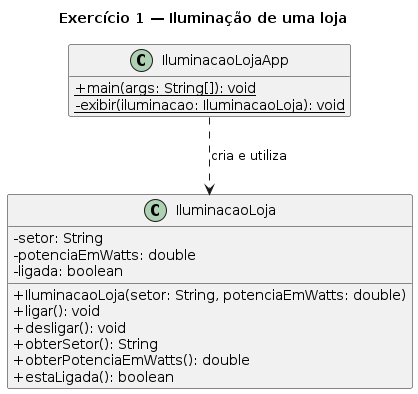
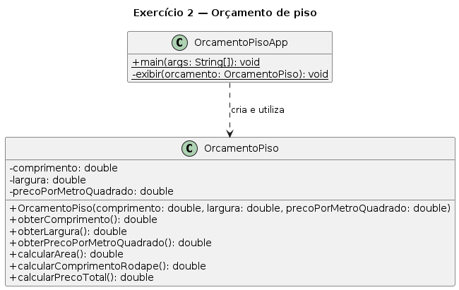
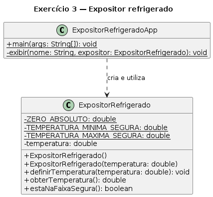
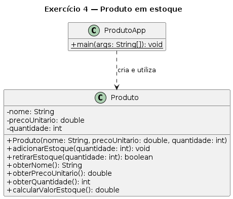
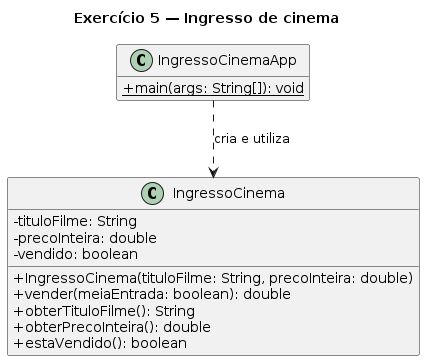
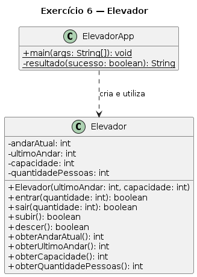
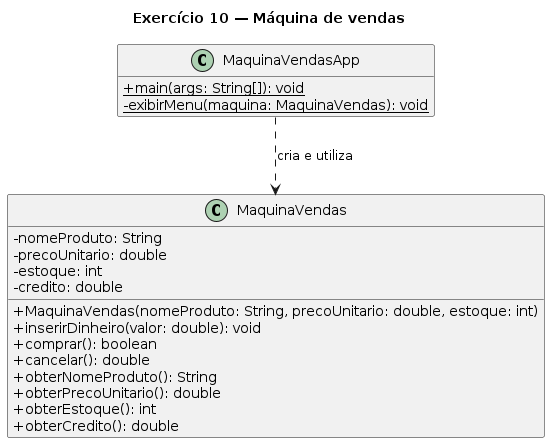

# Prática em sala — classes e objetos

Resolva os exercícios para praticar **abstração**, **classes**, **objetos** e **encapsulamento** em Java.

## Orientações

- Crie um arquivo para cada classe pública indicada.
- Mantenha os atributos de instância `private` e use construtores para estabelecer estados válidos.
- Coloque validações e regras de negócio na classe do domínio, não na classe `App`.
- Crie métodos de consulta somente para informações consultadas e métodos de alteração apenas quando a alteração direta fizer sentido.
- Em cada exercício, crie a classe `App` indicada e teste casos válidos, inválidos e de fronteira.

## Parte I — classes, atributos e objetos

### 1. Iluminação de uma loja

Uma loja controla separadamente a iluminação de seus setores. Crie `IluminacaoLoja` com `setor` (`String`), `potenciaEmWatts` (`double`) e `ligada` (`boolean`). O construtor adota `"Setor não informado"` para setor vazio e `10.0` para potência não positiva. Toda iluminação começa desligada. Implemente `ligar()`, `desligar()`, `estaLigada()` e os métodos de consulta necessários.

Em `IluminacaoLojaApp`, crie as iluminações da vitrine e do estoque, ligue somente a vitrine e apresente o estado de ambas.

**Conceitos principais:** classe, objeto, construtor, estado próprio e métodos de instância.



```text
Vitrine: LIGADA
Estoque: DESLIGADA
```

### 2. Orçamento de piso

Uma empresa precisa estimar o piso de ambientes retangulares. Crie `OrcamentoPiso` com `comprimento`, `largura` e `precoPorMetroQuadrado` (`double`). O construtor adota `1.0` para dimensões não positivas e lança `IllegalArgumentException` para preço não positivo. Implemente métodos de consulta, `calcularArea()`, `calcularComprimentoRodape()` e `calcularPrecoTotal()`, mas não métodos de alteração.

Em `OrcamentoPisoApp`, apresente área, metragem de rodapé e preço de um cômodo de `5.0 m × 3.0 m`, com piso a `R$ 80.00/m²`. Demonstre também uma dimensão inválida.

**Conceitos principais:** normalização de argumentos e métodos com retorno.



### 3. Expositor refrigerado

Um mercado monitora expositores que devem permanecer entre `2.0 °C` e `8.0 °C`. Crie `ExpositorRefrigerado` com `temperatura` (`double`). Ofereça um construtor sem parâmetros, que inicia em `4.0 °C`, e outro com a temperatura inicial. O primeiro delega ao segundo com `this(...)`. Implemente `definirTemperatura()`, `obterTemperatura()` e `estaNaFaixaSegura()`. Valores inferiores a `-273.15 °C` são ignorados e o estado anterior é mantido.

Em `ExpositorRefrigeradoApp`, teste os dois construtores, uma leitura segura, outra fora da faixa e uma alteração fisicamente inválida.

**Conceitos principais:** sobrecarga, delegação com `this(...)` e preservação do estado.



## Parte II — encapsulamento e regras de negócio

### 4. Produto em estoque

Crie `Produto` com `nome` (`String`), `precoUnitario` (`double`) e `quantidade` (`int`). Nome vazio, preço ou quantidade inicial negativos provocam `IllegalArgumentException`.

- `adicionarEstoque(int quantidade)` acrescenta somente quantidades positivas.
- `retirarEstoque(int quantidade)` retira somente uma quantidade positiva disponível e informa sucesso com `boolean`.
- `calcularValorEstoque()` devolve `precoUnitario × quantidade`.
- Permita consultas, mas não crie `definirQuantidade`.

Em `ProdutoApp`, teste entrada, retirada válida e retirada maior que o estoque.

**Conceitos principais:** encapsulamento, exceção e invariante `quantidade >= 0`.



### 5. Ingresso de cinema

Crie `IngressoCinema` com `movieTitle` (`String`), `fullPrice` (`double`) e `sold` (`boolean`). Título vazio e preço não positivo provocam `IllegalArgumentException`. Todo ingresso começa disponível. `sell(boolean halfPrice)` vende apenas se disponível e devolve o preço inteiro ou sua metade; se já vendido, devolve `0.0`. Implemente `isSold()`.

Em `IngressoCinemaApp`, venda um ingresso de meia-entrada e tente vendê-lo novamente.

**Conceitos principais:** abstração, transição de estado e regra protegida pelo objeto.



### 6. Elevador

Crie `Elevador` com `andarAtual`, `ultimoAndar`, `capacidade` e `quantidadePessoas` (`int`). O construtor recebe último andar e capacidade positivos ou lança `IllegalArgumentException`. O elevador começa vazio no térreo (`0`).

- `entrar(int quantidade)` respeita quantidade positiva e capacidade.
- `sair(int quantidade)` respeita quantidade positiva e ocupação.
- `subir()` não ultrapassa o último andar; `descer()` não passa do térreo.
- Os quatro métodos informam sucesso ou recusa com `boolean`.

Em `ElevadorApp`, demonstre todos os limites, usando laços quando apropriado.

**Conceitos principais:** invariantes, controle de estado, seleção e iteração.



### 7. Programa de fidelidade

Uma empresa oferece pontos aos clientes cadastrados. Crie `ClienteFidelidade` com `nome` (`String`), `pontos` (`int`) e `ativo` (`boolean`). Normalize nome vazio para `"Cliente não identificado"`. Todo cliente começa sem pontos e ativo. `acumularPontos(int quantidade)` adiciona pontos positivos a um cadastro ativo. `resgatarPontos(int quantidade)` resgata somente uma quantidade positiva disponível e informa sucesso com `boolean`. `desativar()` desativa o cadastro; depois disso, não é possível acumular nem resgatar pontos.

Em `ClienteFidelidadeApp`, crie dois clientes, registre pontos, realize um resgate válido, tente um resgate sem saldo e demonstre uma operação após a desativação.

**Conceitos principais:** identidade, independência entre objetos e comportamento condicionado ao estado.


## Parte III — referências e colaboração

### 8. Carteira e transferência

Crie `Carteira` com `titular` (`String`) e `saldo` (`double`). Normalize proprietário vazio para `"Sem nome"` e saldo negativo para `0.0`. `adicionarDinheiro(double valor)` aceita valores positivos; `gastar(double valor)` gasta apenas um valor disponível; `transferirPara(Carteira destino, double valor)` transfere somente se o destino não é `null`, não é `this` e há saldo. Os dois últimos informam sucesso com `boolean`. Não crie `definirSaldo`.

Em `CarteiraApp`, demonstre uma transferência válida, outra sem saldo e outra para `null`.

**Conceitos principais:** colaboração, parâmetro de tipo por referência, `this` e encapsulamento.


### 9. Duas referências, um objeto

Use `ClienteFidelidade` do exercício 7. Em `ClienteFidelidadeReferenciaApp`: guarde um cliente em `referenciaOriginal`; atribua-o a `outraReferencia`; credite pontos por `outraReferencia` e consulte-os por `referenciaOriginal`; crie `static void concederBonusPromocional(ClienteFidelidade cliente, int pontos)`; em outro método, atribua `new ClienteFidelidade(...)` ao parâmetro e observe se `referenciaOriginal` muda. Explique os resultados em um comentário.

**Conceitos principais:** aliases e passagem por valor de uma referência.


```text
Pontos creditados por outra referência: 100
Pontos após bônus promocional: 150
Nome após reatribuir o parâmetro: Lara
```

### 10. Máquina de vendas

Crie `MaquinaVendas` para um item, com `nomeProduto` (`String`), `precoUnitario` (`double`), `estoque` (`int`) e `credito` (`double`). Nome vazio, preço não positivo ou estoque negativo provocam `IllegalArgumentException`. `inserirDinheiro(double valor)` aceita valores positivos; `comprar()` compra somente com estoque e crédito suficientes e informa sucesso com `boolean`; `cancelar()` devolve o crédito e o zera. Não ofereça métodos de alteração para estoque ou crédito.

Em `MaquinaVendasApp`, use `Scanner`, `switch` e um laço com opções para inserir dinheiro, comprar, cancelar e encerrar. Ao encerrar, devolva o crédito restante. Teste compras sem crédito e sem estoque.

**Conceitos principais:** modelagem completa, encapsulamento, invariantes, seleção e iteração.


